# 🏛️ OpenPermit — Ultimately Efficient Permitting
> *Permitting distilled for **simplicity, speed & interoperability***

[](LICENSE)
[](./.github/workflows/ci.yml)
[](https://codecov.io/gh/builtbycorelot/OpenPermit)
[](https://builtbycorelot.github.io/OpenPermit)
[](https://github.com/builtbycorelot/OpenPermit/actions/workflows/ci.yml)

**Public demo →** <https://builtbycorelot.github.io/OpenPermit>

---

## Table of Contents
1. [Why OpenPermit?](#why-openpermit)
2. [Quick-start](#quick-start)
3. [Architecture](#architecture)
4. [Standards Alignment](#standards-alignment)
5. [Stakeholders & How to Engage](#stakeholders--how-to-engage)
6. [Security](#security)
7. [Contributing](#contributing)
8. [Links & References](#links--references)

---

## Why OpenPermit?
OpenPermit is an **open-source data layer and toolkit** that modernises construction-permit workflows.

| Feature                                         | Benefit                                                                      |
| ----------------------------------------------- | --------------------------------------------------------------------------- |
| **JSON-LD & IFC mappings**                      | Machine-readable submissions across BIM, GIS & document sets                |
| **NIEM / BLDS / EPA schema generators**         | Auto-align local data with federal & environmental standards                |
| **CKAN bridge**                                 | Publish validated permit data to any CKAN portal for open-data compliance   |
| **Validators & CI runners**                     | Catch errors pre-submission, enable *“submit once, validate everywhere”*    |
| **Reference APIs & UI widgets**                 | Plug-and-play modules for municipal portals or private schedulers           |

---

## Quick-start
```bash
git clone https://github.com/builtbycorelot/OpenPermit.git
cd OpenPermit
npm install                             # install JS dependencies
npm run build
npm test                                # run unit tests
npm run lint
npm run serve


pip install -r requirements.txt
pytest                                 # run unit tests (Python)
python scripts/niem6_build_schemas.py  # generate NIEM-6.0 JSON Schemas
python workflow/validate_workflow.py   # validate workflow JSON-LD
npx playwright install --with-deps    # install browsers & dependencies for E2E tests
npx playwright test                   # run E2E suite


```


Pytest uses the configuration in `pytest.ini` to discover files ending with
`.test.py` in addition to the standard `test_*.py` pattern.
When running in CI, be sure to execute `npx playwright install --with-deps` so that
all system dependencies for the browsers are installed.


The helper scripts rely on Python packages listed in
[`requirements.txt`](requirements.txt). Install them with the `pip` command
shown above before running the scripts.

---

## Architecture
High-level view → [`mermaid/architecture.mmd`](mermaid/architecture.mmd)

```mermaid
flowchart LR
  subgraph Data Core
    A[NODE • JSON-LD<br>NIEM • BLDS]
  end
  subgraph Bridges
    B[IFC ↔ JSON-LD] -->|Geo/BIM| A
    C[CKAN API] -->|Publish| A
  end
  subgraph Services
    D[FastAPI / OData / GraphQL]
  end
  A --> D
  B --> D
  C --> D
```



*The **CKAN API bridge** can push any validated permit dataset straight into a CKAN portal (e.g., `data.gov`-style), preserving metadata and access controls.*

---

## Standards Alignment
| Domain | Core Standards & Bodies | Notes |
| ------ | ----------------------- | ----- |
| **Open-data portals** | **CKAN** (Comprehensive Knowledge Archive Network) | Integration scripts in `integrations/ckan/` publish datasets + resources via CKAN API |
| **Information-exchange** | NIEM 6.0, BLDS, OData, JSON-LD (W3C) | Auto-generated schemas |
| **Built environment** | IFC 4x3, IFC-JSON, ISO 19650, CityJSON, OGC InfraGML | BIM/GIS round-tripping |
| **Environmental & water** | EPA Permit Info Std, NPDES ICIS DED, NEPA / CEQ regs | |
| **Process & workflow** | BPMN 2.0, FAST-41 CPP, EO 13807 (One Federal Decision) | |
| **Security & accessibility** | NIST SP 800-53 r5, FIPS 140-3, WCAG 2.2 | |

---

## Stakeholders & How to Engage

| Stakeholder | Why it matters | First steps |
| ----------- | -------------- | ----------- |
| **Public / Civic Tech** | Browse & reuse open permit data | Visit demo CKAN portal (coming soon) |
| **Builders / Designers** | *Submit once, track everywhere* | Test `workflow.jsonld`, export to CKAN |
| **Agencies & Authorities** | Automatic cross-checks & open-data compliance | Run validator, enable CKAN bridge |
| **Developers** | Extend ontology & build plugins | See [CONTRIBUTING.md](CONTRIBUTING.md) |

---

## Security
We operate a **shift-left security model**—SBOM, SAST & dependency scanning run in CI.  
See [`SECURITY.md`](SECURITY.md) for threat model, disclosure policy & NIST control mapping.

---

## Contributing
PRs welcome!  
1. Follow the guidelines in [`CONTRIBUTING.md`](CONTRIBUTING.md)  
2. Open an issue or discussion for larger features  

---

## Links & References
* Docs portal – [`docs/`](docs/)  
* Full reference list – [`docs/references.md`](docs/references.md)  
* Public site – <https://builtbycorelot.github.io/OpenPermit>  

---
